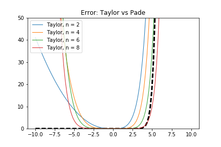

## Report Day1

### Ex1: Taylor Approximation vs Pade Approximation

Everything (timing and error analysis) can be found in the notebook 'day1.ipynb'. The fastest implementation is the numpy one. We alredy know that, since numpy usually uses an optimized algorithm.

A plot of different Taylor approximations

One can easily see that:
* The approximation behaves badly on the boudary of the interval
* Higher the degree the better

A log-plot that shows the different behaviour between Taylor and Pade

One can easily see that the Padè well approximate the exponential in the constant region, but then behaves badly for $x > 5$.


An error analysis was also performed


### Ex2: Spline Approximation

In 'spline.c' I added the following function:

```c
double spl_exp(double x, double x0, double delta, double *xar, double *a, double *b)
{
  //int i = floor(x - x0)/delta + 1;
  int i = 0;
  while( x > xar[i]){
    i += 1;
  }
  return a[i] + b[i] * (x - xar[i - 1]);
 };
```

Below the output after the run:

```
time/set for 1000 x-values :   0.0495us
<x>: 0.0565471    <x**2> - <x>**2: 16.5517589247028
time for                 exp():   0.0450us  numreps 1
time for             spl_exp():   0.0660us  avgerr  0.00331942
```
