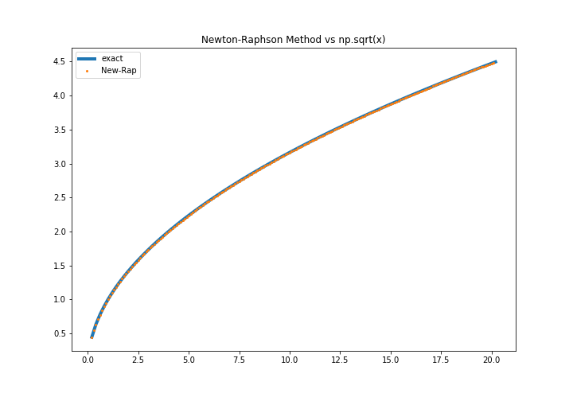

## Report Day2

### Newton-Rapshon Method vs sqrt(x)

The exercise can be found in 'NewtonRaphson_Method.ipynb'.

| Iteration   |      Error      |
|----------|:-------------:|
| 3 |  0.068332 |
| 4 |  0.001128 |
| 5 | 3.183e-07|
| 7 | 0.000e+00 |

Below a figure of the Newton-Rapshon Method


### Fast Square Root - Magic numbers

The implementation is the following:

```c
float Q_rsqrt( float number )
{
  long i;
	float x2, y;
	const float th = 1.5F;

	x2 = number * 0.5F;
  y  = number;
  i  = * ( long * ) &y;
  i  = 0x5f3759df - ( i >> 1 );
  y  = * ( float * ) &i;
  y  = y * ( th - ( x2 * y * y ) );

//        y  = y * ( th - ( x2 * y * y ) );   // 2nd iteration, this can be removed
	return y;
}

```

Running the code with './tester 1000 1', the results are:
```
<x>: 5.02827    <x**2> - <x>**2: 4.13793973117576
time for             invsqrt():   0.0192us  numreps 1
time for             Q_rsqrt():   0.0055us  avgerr  0.0008923
```
